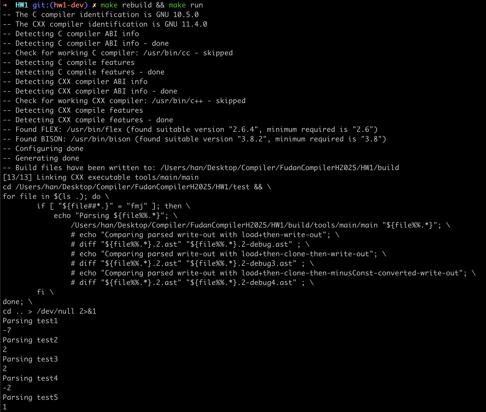
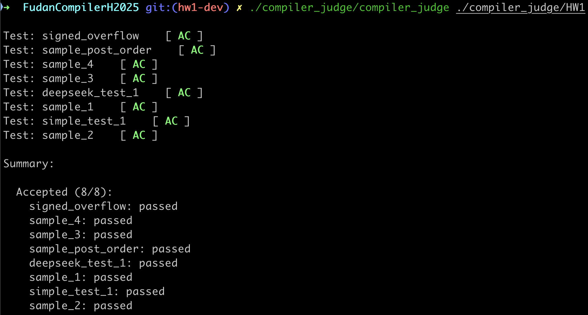

<div style="text-align: center"><h1>
  Compiler Lab Report:
  HW1
  </h1></div>


> **Name**: 韩周吾
>
> **ID**: 22307130440
>
> **Date**: 2025.02.24

## Overview

1. constantPropagation要求两个常数在BinaryOp时，被直接计算并化简为IntExp。 此处只需在visit BinaryOp时，判断参数、计算结果并覆写newnode即可。

2. executor要求预执行代码，合并所有计算节点，最后打印返回值。需要覆写以下visit函数：
   1. Assign：使用unordered_map<string, int>存储变量，并处理右侧的exp为IntExp。
   2. Return：打印结果即可。
   3. BinaryOp：从unordered_map<string, int>调用Assign处的值，将变量IdExp转换为int并计算，最后将整个节点转换成IntExp。
   4. UnaryOp：由于在minusIntConverter中处理过了，此处直接clone即可。
   5. Esc：使用visitList遍历所有Stm，然后处理exp，并调用evaluateExpression计算其值即可。整个节点的值等同于exp的计算结果。其中

   此处为了统一处理，将所有数值计算导入evaluateExpression函数进行计算。

3. 这里实现了FDMJ的所有运算。

---

## Code Implementation

1. **constantPropagation.cc ** ：visit(BinaryOp *node)

对于所有BinaryOp，如果左右均为常量，直接根据op运算得到结果即可。

```cc
  if (l->getASTKind() == ASTKind::IntExp && r->getASTKind() == ASTKind::IntExp) {
    int val1 = static_cast<IntExp *>(l)->val;
    int val2 = static_cast<IntExp *>(r)->val;
    int val = 0;
    if      (node->op->op == "+")  val = val1 +  val2;
    else if (node->op->op == "-")  val = val1 -  val2;
    else if (node->op->op == "*")  val = val1 *  val2;
    else if (node->op->op == "/")  val = val1 /  val2;
    else if (node->op->op == "||") val = val1 || val2;
    else if (node->op->op == "&&") val = val1 && val2;
    else if (node->op->op == "<")  val = val1 <  val2;
    else if (node->op->op == "<=") val = val1 <= val2;
    else if (node->op->op == ">")  val = val1 >  val2;
    else if (node->op->op == ">=") val = val1 >= val2;
    else if (node->op->op == "==") val = val1 == val2;
    else if (node->op->op == "!=") val = val1 != val2;
    else {
      cerr << "Error: Unknown operator in the BinaryOp statement" << endl;
      newNode = nullptr;
      return;
    }
    // switch (node->op->op) // TODO: 需要把op变成enum
    // {
    // case "+":  val = val1 +  val2; break;
    // case "-":  val = val1 -  val2; break;
    // case "*":  val = val1 *  val2; break;
    // case "/":  val = val1 /  val2; break;
    // case "||": val = val1 || val2; break;
    // case "&&": val = val1 && val2; break;
    // case "<":  val = val1 <  val2; break;
    // case "<=": val = val1 <= val2; break;
    // case ">":  val = val1 >  val2; break;
    // case ">=": val = val1 >= val2; break;
    // case "==": val = val1 == val2; break;
    // case "!=": val = val1 != val2; break;
    // default: cerr << "Error: Unknown operator in the BinaryOp statement" << endl; return;
    // }
    newNode = new IntExp(node->getPos()->clone(), val);
    return;
```

2. **executor.cc** ：evaluateExpression(Exp *exp)

对于所有情况处理exp/op并返回int结果。

```cc

int Executor::evaluateExpression(Exp *exp) {
  if (!exp) {
      std::cerr << "Error: Null expression encountered!" << std::endl;
      return 0;
  }

  switch (exp->getASTKind()) {
      case ASTKind::IntExp: {
        return static_cast<IntExp*>(exp)->val;
      }
      case ASTKind::IdExp: {
        IdExp *idExp = static_cast<IdExp*>(exp);
        if (symbolTable.find(idExp->id) != symbolTable.end()) {
          return symbolTable[idExp->id];
        } else {
          std::cerr << "Error: Undefined variable " << idExp->id << std::endl;
          return 0;
        }
      }
      case ASTKind::BinaryOp: {
        BinaryOp *binOp = static_cast<BinaryOp*>(exp);
        int val1 = evaluateExpression(binOp->left);
        int val2 = evaluateExpression(binOp->right);
        string op = static_cast<string>(binOp->op->op);
        if (op == "+")       return val1 + val2;
        else if (op == "-")  return val1 - val2;
        else if (op == "*")  return val1 * val2;
        else if (op == "/") {
          if (!val2) {
            std::cerr << "Error: Division by zero!" << std::endl;
            return 0;
          }
          return val1 / val2;
        }
        else if (op == "||") return val1 || val2;
        else if (op == "&&") return val1 && val2;
        else if (op == "<")  return val1 <  val2;
        else if (op == "<=") return val1 <= val2;
        else if (op == ">")  return val1 >  val2;
        else if (op == ">=") return val1 >= val2;
        else if (op == "==") return val1 == val2;
        else if (op == "!=") return val1 != val2;
        else {
          cerr << "Error: Unknown operator in the BinaryOp statement" << endl;
          newNode = nullptr;
          return 0;
        }
      }
      case ASTKind::Esc: {
        Esc *esc = static_cast<Esc*>(exp);
        visit(esc);
        return static_cast<IntExp*>(esc->exp)->val;
      }
      default:
        cerr << "Type: " << stringASTKind(exp->getASTKind()) << endl;
        cerr << "Error: Unsupported expression type!" << endl;
        return 0;
  }
}

```

3. **executor.cc **: visit(Esc *node)

```cc
  if (node->sl != nullptr)
    sl = visitList<Stm>(*this, node->sl);
  if (node->exp != nullptr) {
    node->exp->accept(*this);
    e = static_cast<Exp *>(newNode);
  }
  int result = evaluateExpression(e);
  node->exp = new IntExp(node->getPos(), result);
```

4. **executor.cc **: visit(BinaryOp *node)

直接调用evaluateExpression。

```cc
  int val1 = evaluateExpression(node->left);
  int val2 = evaluateExpression(node->right);
  int val = evaluateExpression(node);
  newNode = new IntExp(node->getPos()->clone(), val);
```

5. **executor.cc **: visit(Assign *node)

此处针对右侧值做了AST简化。

```cc
  int value = evaluateExpression(node->exp);
  IntExp* intExp = new IntExp(node->getPos()->clone(), value);

  if (l->getASTKind() == ASTKind::IdExp)
    symbolTable[static_cast<IdExp *>(l)->id] = value;

  newNode = new Assign(node->getPos()->clone(), l, intExp);
```

---

## Graphs and Figures





  

## References

- 虎书Ch1/2/3

