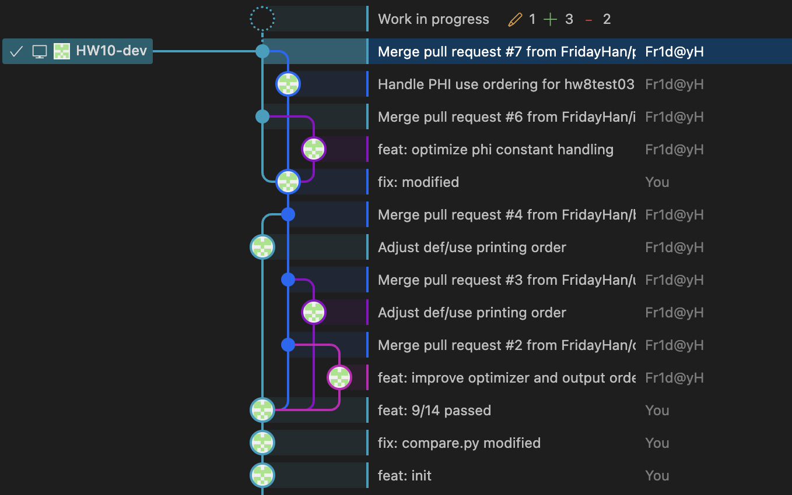
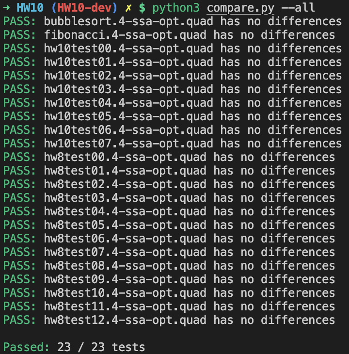

<div style="text-align: center"><h1>
  Compiler Lab Report:
  HW10
  </h1></div>


> **Name**: 韩周吾
>
> **ID**: 22307130440
>
> **Date**: 2025.06.06

---

## 1. `calculateBT()` —— 运行时值分析与可达性计算

```cpp
void Opt::calculateBT() {
    // ① 入口块可达
    if (func->quadblocklist->empty()) return;
    int entry = func->quadblocklist->front()->entry_label->num;
    block_executable[entry] = true;

    /* ---------- λ‑辅助函数 ---------- */
    // (1) 取得单个 QuadTerm 的运行时值
    auto evalTerm = [&](QuadTerm *term) -> RtValue { … };

    // (2) 尝试对左右操作数进行常量折叠
    auto evalBinop = [&](const string &op, RtValue l, RtValue r) -> RtValue { … };

    // (3) PHI 合并策略：只要有冲突就返回 MANY_VALUES
    auto mergeValue = [&](RtValue a, RtValue b) -> RtValue { … };

    // (4) 写入 temp 的新值，判断是否有变化
    auto updateValue = [&](int t, RtValue v) -> bool { … };

    /* ---------- 主迭代 ---------- */
    bool changed = true;
    while (changed) {                       // ② 不动点迭代
        changed = false;
        for (auto &block : *func->quadblocklist) {
            if (!block_executable[block->entry_label->num]) continue;

            for (auto &stm : *block->quadlist) {
                switch (stm->kind) {
                    case QuadKind::MOVE: {           // ③ 简单赋值
                        RtValue v = evalTerm(static_cast<QuadMove*>(stm)->src);
                        if (updateValue(static_cast<QuadMove*>(stm)->dst->temp->num, v))
                            changed = true;
                        break;
                    }
                    case QuadKind::LOAD:             // ④ 可能来自内存 => MANY_VALUES
                    case QuadKind::MOVE_CALL:        // ⑤ 函数调用
                    case QuadKind::MOVE_EXTCALL: {
                        auto tgt = static_cast<QuadMove*>(stm)->dst->temp->num;
                        if (updateValue(tgt, RtValue(ValueType::MANY_VALUES)))
                            changed = true;
                        break;
                    }
                    case QuadKind::MOVE_BINOP: {     // ⑥ 二元操作常量折叠
                        auto m = static_cast<QuadMoveBinop*>(stm);
                        RtValue v = evalBinop(m->binop,
                                             evalTerm(m->left),
                                             evalTerm(m->right));
                        if (updateValue(m->dst->temp->num, v))
                            changed = true;
                        break;
                    }
                    case QuadKind::PHI: {            // ⑦ PHI 节点合并
                        …  // 见上方 mergeValue 调用
                        break;
                    }
                    case QuadKind::CJUMP: {          // ⑧ 条件跳转剪枝
                        …  // 若左右为常量则确定唯一分支
                        break;
                    }
                    case QuadKind::JUMP: {           // ⑨ 无条件跳转
                        …  // 目标块标记为可达
                        break;
                    }
                    default: break;
                }
            }
        }
    }
}
```

- **入口可达性**：入口基本块先置为 `true`，其余为 `false`。
- **辅助 λ**：
  - `evalTerm` 与 `evalBinop` 将“值传播”与“常量折叠”解耦，保持循环主体简洁。
  - `mergeValue` 实现 Tiger‑book 19.3 中的 **三态格**并集规则。
  - `updateValue` 负责记录变化并驱动迭代。
- **迭代收敛**：只要有新的 temp/块状态改变就继续，保证到达不动点。
- **控制流处理**：
  - `CJUMP` 若比较数均为常量则只标记真/假分支之一；否则两分支皆可达。
  - `JUMP` 始终标记目标块可达。

------

## 2. `modifyFunc()` —— 常量替换、指令删除与块精简

```cpp
void Opt::modifyFunc() {
    vector<QuadBlock*> *newBlocks = new vector<QuadBlock*>();
    std::set<int> removed_bases;

    /* ---------- Ⅰ 预处理：PHI 参数常量化 ---------- */
    for (auto &block : *func->quadblocklist) {
        if (!block_executable[block->entry_label->num]) continue;
        for (auto &stm : *block->quadlist) {
            if (stm->kind != QuadKind::PHI) continue;
            … // 若某参数对应 temp 已是 ONE_VALUE，
              // 则在前驱块插入 materialize MOVE
        }
    }

    /* ---------- Ⅱ 收集所有 PHI 使用到的 temp ---------- */
    std::set<int> phi_uses = collectPhiUses();   // 见代码片段

    /* ---------- Ⅲ 遍历可执行块，重写 / 删除指令 ---------- */
    for (auto &block : *func->quadblocklist) {
        if (!block_executable[block->entry_label->num]) continue;
        vector<QuadStm*> *newList = new vector<QuadStm*>();

        for (auto &stm : *block->quadlist) {
            switch (stm->kind) {
                /* ---- MOVE / STORE / BINOP：源为常量时替换 ---- */
                case QuadKind::MOVE:
                case QuadKind::STORE:
                case QuadKind::MOVE_BINOP: {
                    replaceTempWithConst(stm);      // λ 函数：遍历 src/dst
                    if (dstIsConstAndUnused(stm, phi_uses, removed_bases))
                        break;                      // 删除整条指令
                    newList->push_back(stm);
                    break;
                }

                /* ---- CALL / EXTCALL ---- */
                case QuadKind::MOVE_CALL:
                case QuadKind::MOVE_EXTCALL: {
                    rewriteCallArgs(stm);
                    if (dstIsConst(stm)) removed_bases.insert(baseOf(dst));
                    else newList->push_back(stm);
                    break;
                }

                /* ---- PHI：输出已定值则删除 ---- */
                case QuadKind::PHI: {
                    if (!phiResultIsConst(stm)) newList->push_back(stm);
                    else removed_bases.insert(baseOf(phiTemp));
                    break;
                }

                /* ---- CJUMP 常量折叠为 JUMP ---- */
                case QuadKind::CJUMP: {
                    foldCJumpIfConst(stm);          // λ 函数
                    newList->push_back(stm);
                    break;
                }

                /* ---- 其它保持不变 ---- */
                default:
                    newList->push_back(stm);
            }
        }

        /* ---------- Ⅳ 更新块出口标签并收集 ---------- */
        rebuildExitLabels(block, newList);
        newBlocks->push_back(block);
    }

    /* ---------- Ⅴ 替换函数块列表 & 调试输出 ---------- */
    func->quadblocklist = newBlocks;
    func->last_temp_num += 2;        // 留安全余量
    std::cout << "Removed bases: " << removed_bases.size() << std::endl;
}
```

- **阶段Ⅰ**：SSA 语义禁止常量直接出现在 PHI 实参中。算法自动为每个 **常量实参**插入一次 `MOVE const → new_tmp`，再用 `new_tmp` 替换原参数。
- **阶段Ⅱ**：提前收集所有 PHI 用到的临时编号，后续删除时避免破坏 SSA 结构。
- **阶段Ⅲ**：
  - **常量传播**：统一通过 λ `replaceTempWithConst` 将 `TEMP`‑>常量字面量，同时维护 `use` 集合。
  - **死代码删除**：目标 temp 已确定为常量且未被 PHI 使用时直接删整条语句。
  - **恒定分支折叠**：`CJUMP` 左右均变为常量后，构造简化的 `JUMP` 指令。
- **阶段Ⅳ**：重新计算 `exit_labels`，保持控制流图一致。
- **阶段Ⅴ**：输出调试信息 `Removed bases`，表征被整体删去的常量临时基号数量。

------

## 3. 辅助 λ 函数

| λ 名称                 | 功能概述                              | 关键返回值                           |
| ---------------------- | ------------------------------------- | ------------------------------------ |
| `evalTerm`             | 返回 **单个** `QuadTerm` 的 `RtValue` | `NO_VALUE / ONE_VALUE / MANY_VALUES` |
| `evalBinop`            | 若左右可确定则立即计算 `+ - * /`      | 失败时返回 `MANY_VALUES`             |
| `mergeValue`           | PHI 合并规则                          | 两值冲突则 `MANY_VALUES`             |
| `updateValue`          | 判断 temp 值是否变化                  | `bool changed`                       |
| `replaceTempWithConst` | 语句级：用常量替换源/目的 temp        | 修改 `use/def` 集合                  |
| `foldCJumpIfConst`     | 条件跳转恒定化为 `JUMP`               | 精简 CFG                             |
| `rebuildExitLabels`    | 重新填充 `block->exit_labels`         | 保证 CFG 正确性                      |

------

## Graphs and Figures




