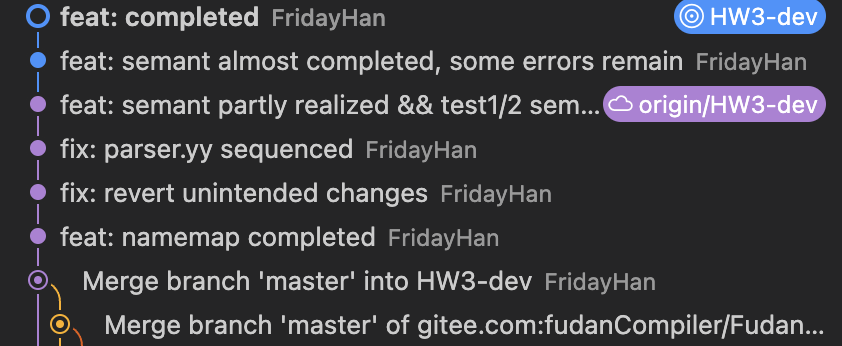

<h1>
  Compiler Lab Report:
  HW3
  </h1>

> **Name**: 韩周吾
>
> **ID**: 22307130440
>
> **Date**: 2025.03.29

## Overview

1. 我在namemap中, 在类继承的时候, 拷贝所有变量和方法

---

## Code Implementation

1. Graphs and Figures

  

## References

- 

