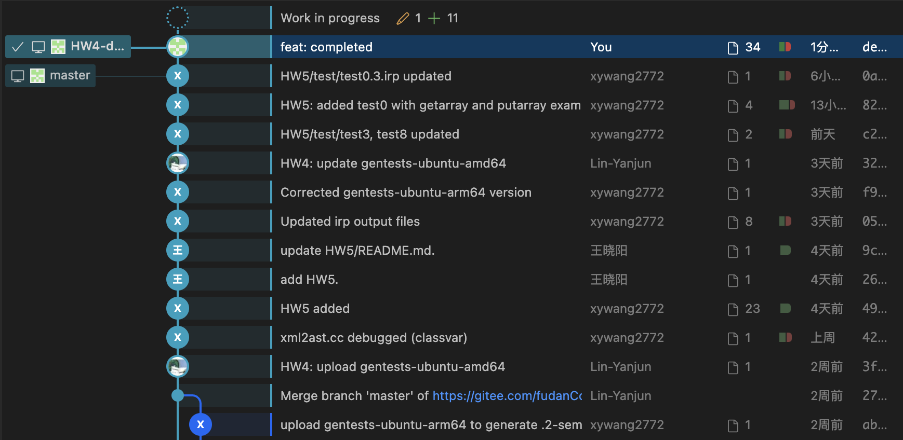
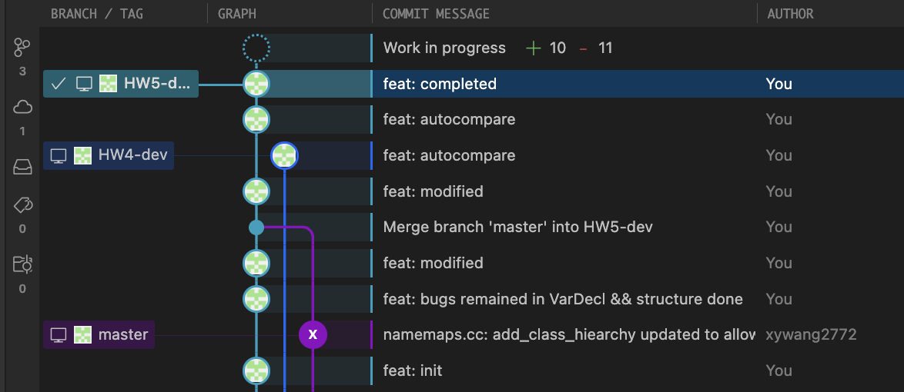
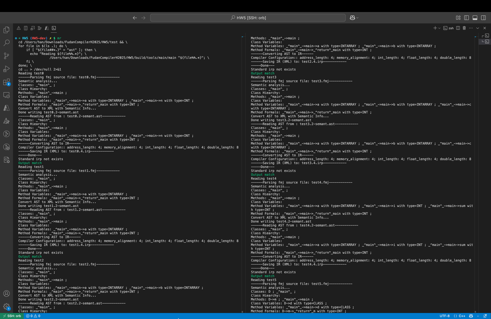
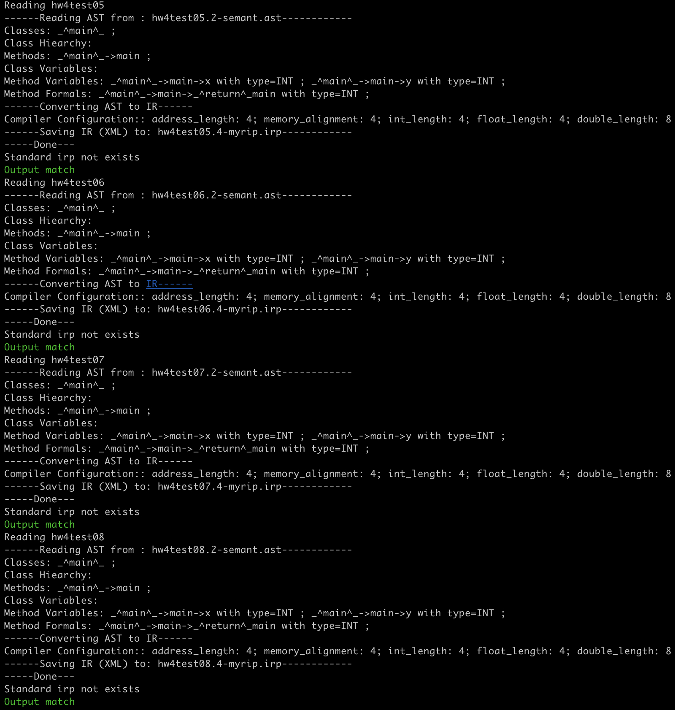
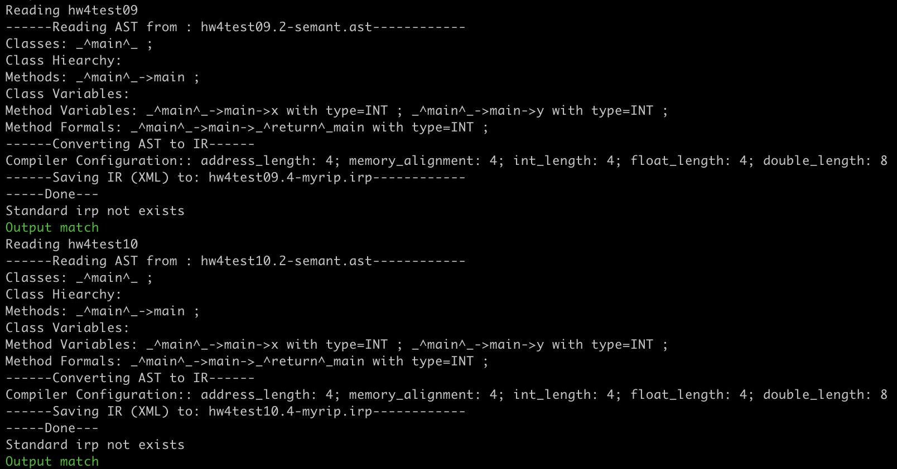
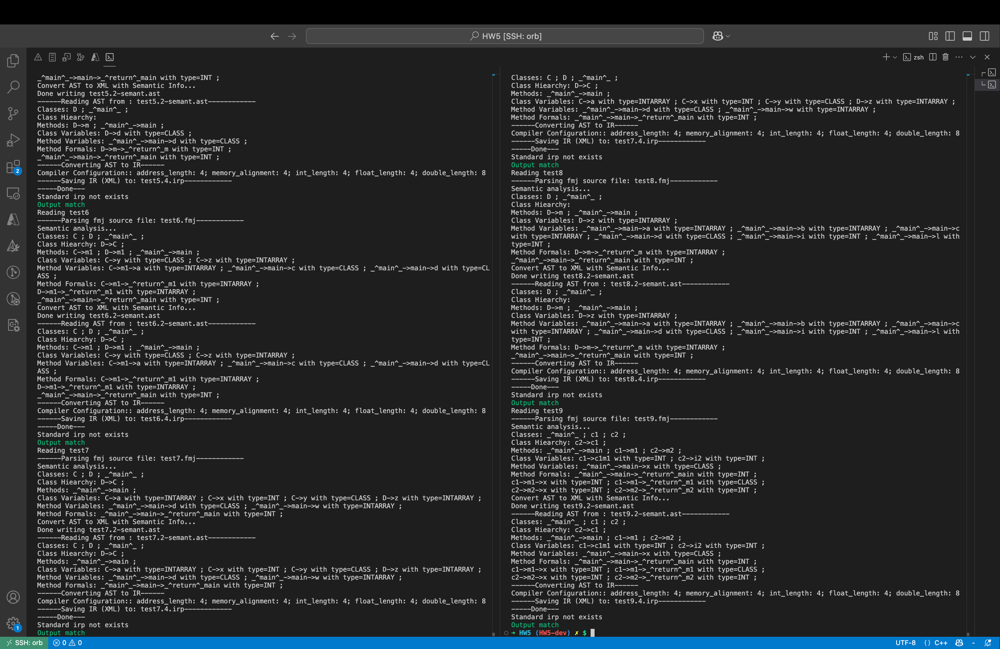

<h1>
  Compiler Lab Report:
  HW4
  </h1>

> **Name**: 韩周吾
>
> **ID**: 22307130440
>
> **Date**: 2025.04.19

## Q1

### Q1.1

- `Program`：整个程序

- `FuncDecl`：函数定义

- `Block`：基本块

- `Stm`： 语句的抽象基类

- `Jump`：无条件跳转语句

- `Cjump`：条件跳转语句

- `Move`：赋值语句

- `Seq`：语句序列，即按顺序执行的一组语句

- `LabelStm`：程序跳转目标，类似`asm`中的标签

- `Return`：函数返回语句

- `Phi`：用于 `SSA` 形式（目前不知道是什么）

- `ExpStm`：将一个有副作用的表达式当作语句使用，忽略其返回值

- `Exp`：表达式的抽象基类

- `Binop`：二元运算表达式

- `Mem`：访问内存地址

- `TempExp`：临时变量访问，通过 `Temp` 引用 IR 中的寄存器

- `Eseq`：先执行语句再计算表达式，用于表达式含副作用的情况

- `Name`：将 `Label` 转换为指针值，用于跳转表

- `Const`：常量

- `Call`：函数调用

- `ExtCall`：语言自带函数

### Q1.2

- `Program`：整个程序，`Tiger IR`把表达式作为独立体，我们的`Tiger IR+`需要对整个程序进行分析。

- `FuncDecl`：函数定义，理由同上。

- `Block`：基本块，有单一入口和多个出口，理由同上，后续可以构建`CFG`。

- `Return`：显式返回，理由同上，`Tiger IR`等价于单一函数，不存在返回。

- `Phi`：用于SSA 形式，合并来自不同控制路径的变量值。（目前不太清楚是做什么的）

- `ExtCall`：对语言自带函数的调用，与普通 `Call` 区分，`Tiger IR`没有语言自带调用函数。

## Q2

- `If`：

  - 分别考虑stm1和stm2的非空情况，然后设置对应跳转（没有某个分支，就直接跳到end），跳转后执行对应代码即可
  - 使用`unCx`获取`cjump`语句
  - 使用`patch`，将跳转指针绑定label
  - 在节点出入口，放入对应label

  

- `While`：

  - 实现和`If`类似，额外需要一个无条件跳转
  - `break`只要无条件跳转至`while_end`即可
  - `continue`只要无条件跳转至`while_test`即可

  

- `Assign`：

  - 将`left`处理成temp
  - 然后将处理好的`exp`作为右值即可

  

- `Return`：

  - 处理返回值，然后直接设定`visit_tree_result`为`Return`节点即可

  

- `BinaryOp`：

  - 分为3类运算处理：逻辑运算、算术运算、比较运算
  - 首先处理逻辑运算：
    - 左右子树分别用`unCx()`转换为`Tr_cx`
    - 中间插入`mid_label`实现短路连接，对条件依次分析
  - 然后处理算术运算：
    - 直接生成`Binop`即可
  - 最后处理比较运算：
    - 左右子树处理为`Tr_ex`
    - 构造`cjump`，放入label并patch即可

  

- `UnaryOp`：

  - 套用`Binop`（第二个操作数为0）即可

  

- `Esc`：

  - 依次访问`sl`，然后处理`exp`即可，最后合成`Eseq`

  

- `IdExp`：

  - 通过`method_var_table_map`找到`method`的`map`
  - 如果没找到变量，那么添加；如果找到了，那么提取
  - 表达式转换成TempExp

- `Array`：

  - 数组初始化

    1. 计算元素个数 n  

    2. 调用 `malloc((n+1)*4)` 分配空间，首位存放 n （长度字段）  

    3. 依次为每个 `ci` 计算偏移 `(i+1)*4`，用 `tree::Move(new tree::Mem(...), Const(ci))` 赋值  

    4. 将所有语句封成 `tree::Seq`，返回。

  - 数组赋值

    1. 翻译索引和值，得到其 `tree::Exp`  

    2. 计算偏移地址 `base + (idx+1)*4`  

    3. 生成 `new tree::Move(new tree::Mem(tree::Type::INT, addr), value)`。

  - 数组访问

    1. 翻译 `idx`，如有复杂 Eseq/Call 先落到临时 var  

    2. 翻译 `a`，如有复杂表达式同上  

    3. 越界检查：  

       - 从 `a` 读出长度字段 `len = Mem(a)`  

       - 生成 `Cjump(idx >= len, L_err, L_ok)`；`L_err` 调用 `exit(-1)`  

    4. 成功分支 `L_ok` 下计算 `addr = a + (idx+1)*4`  

    5. 用 `new tree::Mem(tree::Type::INT, addr)` 读取元素。

  - 数组长度（即length）

    1. 翻译数组为地址表达式  

    2. `new tree::Eseq( Int, Move(tmp, Mem(a)), tmp )`，即：  

       - `tmp = Mem(a)`（读首位）  

       - 返回 `tmp`

  - 数组运算

    - 分别读出两数组长度并做越界相等检查  

    - 调用 `malloc` 分配新数组，写入长度字段  

    - 构造循环：从 offset=4 开始，每次增 4  

    - 新数组地址封装在 `Eseq` 中  

- 辅助函数：

- **分析辅助函数**

  `translateMainMethod`：

  - 为整个程序的 main 方法初始化翻译上下文（cname="*^main^*"，mname="main"），调用 visitor 访问 AST 中的 main 节点，并将生成的 visit_tree_result 转为 tree::FuncDecl 返回。

  `translateClassMethods`：

  - 遍历 AST 中所有类（ClassDecl）及其方法（MethodDecl），为每个方法初始化上下文，访问生成对应的 tree::FuncDecl 并追加到外部传入的函数列表中。

  `generate_mainmethod_body`：

  - 根据 entryLabel 先生成 main 方法的局部变量声明语句列表，再翻译方法体语句，最后将这些语句封装到一个只有入口标签的 tree::Block 向量中返回。

  `generate_local_var_decls`：

  - 以 entryLabel 开头，插入 LabelStm，然后从符号表 Name_Maps 中获取当前方法所有变量声明（VarDecl），依次访问生成对应 IR，将结果（Move 或 Seq）展开并追加到 stmts 列表中。

  `emitVarDecl`：

  - 根据 VarDecl 的类型（INT、ARRAY、CLASS）分发到不同的处理函数（handle_int_decl、handle_array_decl、handle_class_decl），生成具体的变量声明 IR，并清空 expResult。

  `handle_int_decl`：

  - 如果 VarDecl 带有 IntExp 初始化值，则访问该表达式生成 expResult，再构造一条 Move(dest, value)；否则直接置 visit_tree_result 为 nullptr（无初始化）。

  `handle_array_decl`：

  - 计算数组长度（优先用 init 列表大小），生成 malloc 调用为数组分配内存并存储长度，再遍历 init 列表为每个元素生成存储语句，最后将所有语句封装为 tree::Seq。

  `handle_class_decl`：

  - 为类对象分配内存（根据 classTable 大小），然后按字段偏移遍历所有非类类型字段，递归 emitVarDecl 填充默认值；再按继承链为每个方法填充方法指针 (String_Label)，所有语句封装为 tree::Seq。

  `generate_param_list`：

  - 构建当前方法的参数临时变量列表：第一个是 this 指针，后续按 Name_Maps 中的形参顺序依次取出相应的 temp。

  `generate_method_body`：

  - 类似 generate_mainmethod_body，为任意 MethodDecl 生成一个包含入口 Label、局部变量声明、方法体 Stm 列表和出口标签集合的 tree::Block。

  `get_return_type`：

  - 从当前方法变量表中获取存储返回值的特殊变量 (*^return^* + methodName) 的类型，用于函数签名或调用时确定返回类型。

  `buildMethodCall`：

  - 翻译面向对象方法调用：先访问 obj 得到 this 指针，再根据语义信息和 classTable 计算方法偏移，从对象内存中读取方法地址（vptr），构造参数列表（this + 各实参），最终生成间接调用的 tree::Call。

  `appendLengthCheck`：

  - 向给定 stmts 列表中插入长度比较的 Cjump，如果左右长度不相等则跳转到 error 标签并调用 exit(-1)，否则继续执行。

  `createArrayBinaryOp`：

  - 将两个数组按指定二元操作符逐元素运算：先读取各自长度，插入长度检查，计算新数组大小，malloc 分配并写入长度，再用循环读取左右元素、生成运算结果并写入新数组，返回包含所有语句和结果地址的 tree::Eseq。

  `allocateArray`：

  - 根据 lengthExpr 计算字节数，生成 malloc 调用分配内存，并在分配的首地址存储长度，返回表示数组地址的临时 Exp（TempExp）。

  `appendArrayLoop`：

  - 在已有 stmts 列表中生成一个基本数组遍历循环：从 offset=4 开始到总字节数，依次读取源数组元素，根据 op 构造运算表达式并写入目标数组。

  `UnOp_Array`：

  - 处理一元数组运算：先读取原数组长度并 malloc 新数组，然后在循环中对每个元素应用指定的一元操作符，生成结果数组，最后返回包含所有语句和新数组地址的 tree::Eseq。

  `materializeIfNeeded`：

  - 如果 expr 已经是 tree::Eseq 或 tree::Call，需要先将其结果 Move 到一个新临时变量，然后将 stmts 中插入该 Move，使后续 IR 操作可以安全复用，返回可能替换后的 expr。

  `buildBoundCheck`：

  - 为数组下标访问生成越界检查：读取存储在数组首地址的长度，比较 idx 和长度，如果 idx ≥ 长度则 exit(-1)，否则继续，并将检查包装在 Eseq 中返回安全的 idx。

  `generate_call_expr`：

  - 翻译普通函数调用（非面向对象）：访问 object（可能是静态函数或 this），构造参数列表，获取函数返回类型，生成 tree::Call 并存入 expResult。

  `emitSimpleInput`：

  - 针对无返回值的外部输入函数（如 getInt、getChar）直接生成一个 tree::ExtCall，将结果放入 expResult，但不设置 visit_tree_result。

  `handle_invalid_id`：

  - 在遇到无法解析的 IdExp 时，打印错误信息，并为其生成一个新的临时变量默认值，保证后续 IR 能继续平滑构建。

  `resolve_variable`：

  - 在方法变量表中查找指定名称的临时变量及其类型；若不存在，则创建新的 temp，依据 AST 语义（ARRAY/CLASS）设置默认类型为 PTR，否则默认 INT，并返回是否成功找到的标志。

## Q3

1. **方法重命名**
   - 给每个方法加上类名前缀，用 `ClassName^MethodName` 作为函数名，消除了“类”概念。
   - `main` 方法特殊地命名为 `_^main^_^main` 或直接约定为第一个函数。
2. **参数列表**
   - **主方法**：无参数
   - **类方法**：在第一个位置插入一个指向当前对象的 `this` 指针，后续才是显式的形参。
3. **`this` 的处理**
   - `generate_method_var_table` 会为每个对象方法创建一个名为 `_^this^_` 的临时变量，`generate_param_list` 将它放到参数列表首位。
   - 在方法体内，用这个 temp 来代表对象基址，所有对字段和对方法的访问，都以它为根做地址计算或 vtable 读取。
4. **类变量/方法记录**
   - 使用一个全局的 `Class_table`（Unified Object Record）来存储所有类中出现过的字段名与方法名对应的内存偏移。
   - 因此不同类间共享同一个“布局表”，便于在生成 IR 时统一处理对象访问、方法查找，并简化代码生成逻辑。
5. **多态实现**
   - 在对象创建（`new`）时，`handle_class_decl` 会按子类优先、再父类的顺序，把每个方法对应的标签写入对象的虚方法表（vtable）区域。
   - 方法调用时不硬编码函数地址，而是：
     1. 从 `this + methodOffset` 读出一个函数指针；
     2. 用 `tree::Call` 或间接调用，保证了运行时动态绑定。
6. **类相关操作翻译**
   - **对象初始化**：`malloc(class_size)` → 初始化所有非对象字段 → 填写 vtable。
   - **字段访问**：用 `tree::Binop(..., "+", thisPtr, Const(fieldOffset))` 得到成员地址 → `tree::Mem` 读取或写入。
   - **方法调用**：先载入函数指针，再把 `this` 与其他实参一起传给 `tree::Call`。

---

## Graphs and Figures

    

