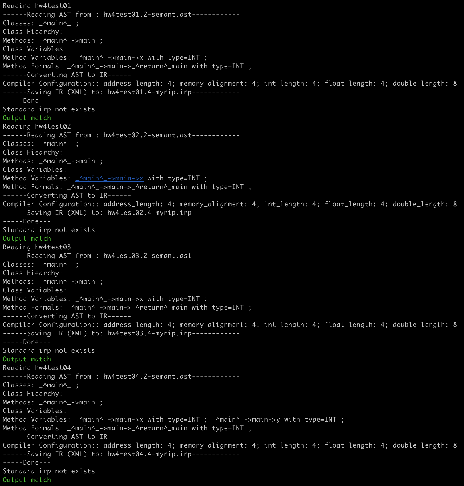

<h1>
  Compiler Lab Report:
  HW4
  </h1>

> **Name**: 韩周吾
>
> **ID**: 22307130440
>
> **Date**: 2025.04.10

## Q1

### Q1.1

- `Program`：整个程序

- `FuncDecl`：函数定义

- `Block`：基本块

- `Stm`： 语句的抽象基类

- `Jump`：无条件跳转语句

- `Cjump`：条件跳转语句

- `Move`：赋值语句

- `Seq`：语句序列，即按顺序执行的一组语句

- `LabelStm`：程序跳转目标，类似`asm`中的标签

- `Return`：函数返回语句

- `Phi`：用于 `SSA` 形式（目前不知道是什么）

- `ExpStm`：将一个有副作用的表达式当作语句使用，忽略其返回值

- `Exp`：表达式的抽象基类

- `Binop`：二元运算表达式

- `Mem`：访问内存地址

- `TempExp`：临时变量访问，通过 `Temp` 引用 IR 中的寄存器

- `Eseq`：先执行语句再计算表达式，用于表达式含副作用的情况

- `Name`：将 `Label` 转换为指针值，用于跳转表

- `Const`：常量

- `Call`：函数调用

- `ExtCall`：语言自带函数

### Q1.2

- `Program`：整个程序，`Tiger IR`把表达式作为独立体，我们的`Tiger IR+`需要对整个程序进行分析。

- `FuncDecl`：函数定义，理由同上。

- `Block`：基本块，有单一入口和多个出口，理由同上，后续可以构建`CFG`。

- `Return`：显式返回，理由同上，`Tiger IR`等价于单一函数，不存在返回。

- `Phi`：用于SSA 形式，合并来自不同控制路径的变量值。（目前不太清楚是做什么的）

- `ExtCall`：对语言自带函数的调用，与普通 `Call` 区分，`Tiger IR`没有语言自带调用函数。

## Q2

- `If`：

  - 分别考虑stm1和stm2的非空情况，然后设置对应跳转（没有某个分支，就直接跳到end），跳转后执行对应代码即可
  - 使用`unCx`获取`cjump`语句
  - 使用`patch`，将跳转指针绑定label
  - 在节点出入口，放入对应label

  

- `While`：

  - 实现和`If`类似，额外需要一个无条件跳转
  - `break`只要无条件跳转至`while_end`即可
  - `continue`只要无条件跳转至`while_test`即可

  

- `Assign`：

  - 将`left`处理成temp
  - 然后将处理好的`exp`作为右值即可

  

- `Return`：

  - 处理返回值，然后直接设定`visit_tree_result`为`Return`节点即可

  

- `BinaryOp`：

  - 分为3类运算处理：逻辑运算、算术运算、比较运算
  - 首先处理逻辑运算：
    - 左右子树分别用`unCx()`转换为`Tr_cx`
    - 中间插入`mid_label`实现短路连接，对条件依次分析
  - 然后处理算术运算：
    - 直接生成`Binop`即可
  - 最后处理比较运算：
    - 左右子树处理为`Tr_ex`
    - 构造`cjump`，放入label并patch即可

  

- `UnaryOp`：

  - 套用`Binop`（第二个操作数为0）即可

  

- `Esc`：

  - 依次访问`sl`，然后处理`exp`即可，最后合成`Eseq`

  

- `IdExp`：

  - 通过`method_var_table_map`找到`method`的`map`
  - 如果没找到变量，那么添加；如果找到了，那么提取
  - 表达式转换成TempExp

---

## Graphs and Figures

  

