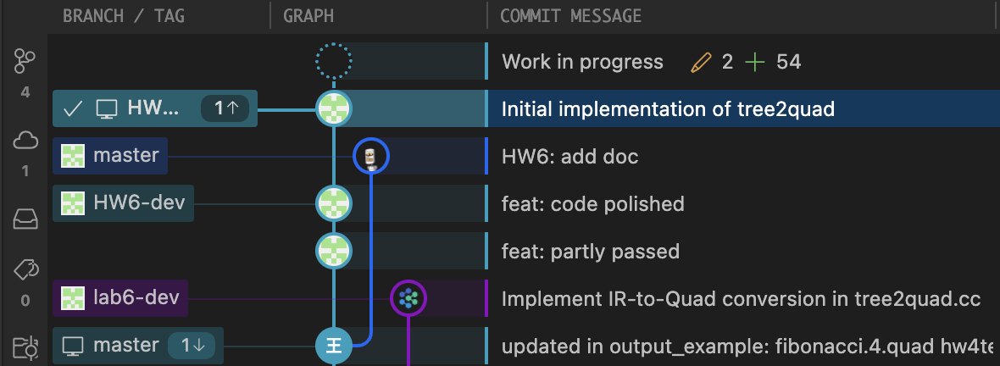

<div style="text-align: center"><h1>
  Compiler Lab Report:
  HW6
  </h1></div>


> **Name**: 韩周吾
>
> **ID**: 22307130440
>
> **Date**: 2025.04.24

#### 1. **`tree2quad` 函数**

该函数是程序的入口点，负责将 IR 程序转换为 Quad 程序。它初始化了一个 `Tree2Quad` 访问者对象，并调用其 `visit_result` 来完成具体的转换工作。最终返回生成的 `QuadProgram` 对象。

```cpp
QuadProgram *tree2quad(Program *prog) {
  Tree2Quad visitor;
  visitor.quadprog = nullptr;
  visitor.visit_result = nullptr;
  visitor.output_term = nullptr;
  visitor.temp_map = new Temp_map();
  visitor.current_func_decl = nullptr;
  prog->accept(visitor);
  return visitor.quadprog;
}
```

- 初始化访问者，设置必要的成员变量。
- 通过 `prog->accept(visitor)` 启动访问过程，遍历 IR 树。
- 最终返回生成的 Quad 程序。

#### 2. **`visit(Program *prog)`**

该函数处理 `Program` 类型的节点，负责遍历程序中的所有函数声明，并生成相应的 `QuadFuncDecl` 对象。

```cpp
void Tree2Quad::visit(Program *prog) {
  vector<QuadFuncDecl *> *funcs = new vector<QuadFuncDecl *>();
  if (prog->funcdecllist) {
    for (FuncDecl *func : *(prog->funcdecllist)) {
      func->accept(*this);
      if (current_func_decl) {
        funcs->push_back(current_func_decl);
        current_func_decl = nullptr;
      }
    }
  }
  quadprog = new QuadProgram(prog, funcs);
  resetVisitResults();
}
```

- 遍历程序的所有函数，并生成相应的 `QuadFuncDecl` 对象。
- 存储在 `QuadProgram` 中，完成 IR 到 Quad 的转换。

#### 3. **`visit(FuncDecl *node)`**

该函数处理函数声明 (`FuncDecl`) 节点，生成函数的参数和代码块，并创建 `QuadFuncDecl` 对象。

```cpp
void Tree2Quad::visit(FuncDecl *node) {
  vector<Temp *> *params = new vector<Temp *>();
  if (node->args) {
    for (Temp *param : *(node->args)) {
      params->push_back(param);
    }
  }
  vector<QuadBlock *> *blocks = new vector<QuadBlock *>();
  temp_map->next_temp = node->last_temp_num + 1;
  temp_map->next_label = node->last_label_num + 1;
  QuadFuncDecl *func_decl = new QuadFuncDecl(node, node->name, params, blocks, node->last_temp_num, node->last_label_num);
  current_func_decl = func_decl;
  
  if (node->blocks) {
    for (Block *block : *(node->blocks)) {
      block->accept(*this);
    }
  }
  func_decl->last_temp_num = temp_map->next_temp - 1;
  func_decl->last_label_num = temp_map->next_label - 1;
  visit_result = new vector<QuadStm *>();
}
```

- 生成函数的参数列表，并初始化 `temp_map` 以管理临时变量和标签。
- 为每个代码块创建 `QuadBlock`，并将其添加到 `QuadFuncDecl` 中。

#### 4. **`visit(Block *block)`**

该函数处理代码块 (`Block`) 节点，遍历块中的所有语句并生成相应的 Quad。

```cpp
void Tree2Quad::visit(Block *block) {
  vector<QuadStm *> *stms = new vector<QuadStm *>();
  if (block->sl) {
    for (Stm *stm : *(block->sl)) {
      stm->accept(*this);
      if (visit_result && !visit_result->empty()) {
        stms->insert(stms->end(), visit_result->begin(), visit_result->end());
      }
    }
  }
  QuadBlock *quad_block = new QuadBlock(block, stms, block->entry_label, block->exit_labels);
  if (current_func_decl) {
    current_func_decl->quadblocklist->push_back(quad_block);
  }
  visit_result = new vector<QuadStm *>();
}
```

- 遍历代码块中的每个语句，生成相应的 Quad 语句。
- 将生成的 `QuadBlock` 添加到当前函数的代码块列表中。

#### 5. **`visit(Jump *node)`**

该函数处理跳转语句 (`Jump`) 节点，生成相应的 `QuadJump` 四元式。

```cpp
void Tree2Quad::visit(Jump *node) {
  set<Temp *> *def = new set<Temp *>();
  set<Temp *> *use = new set<Temp *>();
  QuadJump *jump_quad = new QuadJump(node, node->label, def, use);
  visit_result = new vector<QuadStm *>(1, jump_quad);
}
```

- 创建 `QuadJump` 对象，并将其存储在 `visit_result` 中。

#### 6. **`visit(tree::Cjump *node)`**

该函数处理条件跳转 (`Cjump`) 节点，生成 `QuadCJump` 四元式。

```cpp
void Tree2Quad::visit(tree::Cjump *node) {
  vector<QuadStm *> *result = new vector<QuadStm *>();
  node->left->accept(*this);
  QuadTerm *left_term = output_term;
  if (visit_result != nullptr) {
    result->insert(result->end(), visit_result->begin(), visit_result->end());
  }
  node->right->accept(*this);
  QuadTerm *right_term = output_term;
  if (visit_result != nullptr) {
    result->insert(result->end(), visit_result->begin(), visit_result->end());
  }
  set<Temp *> *def = new set<Temp *>();
  set<Temp *> *use = new set<Temp *>();
  if (left_term->kind == QuadTermKind::TEMP) {
    use->insert(left_term->get_temp()->temp);
  }
  if (right_term->kind == QuadTermKind::TEMP) {
    use->insert(right_term->get_temp()->temp);
  }
  QuadCJump *cjump_quad = new QuadCJump(node, node->relop, left_term, right_term, node->t, node->f, def, use);
  result->push_back(cjump_quad);
  visit_result = result;
}
```

- 对左右操作数进行递归访问，生成中间四元式。
- 创建 `QuadCJump` 对象并添加到 `visit_result` 中。

#### 7. **`visit(Move *node)`**

该函数处理赋值语句 (`Move`) 节点，支持各种赋值模式（如 `Store`、`Load`、`Binop` 等）。

```cpp
void Tree2Quad::visit(Move *node) {
  if (node->dst->getTreeKind() == Kind::MEM) {
    // Store operation: mem(addr) <- src
  } else if (node->dst->getTreeKind() == Kind::TEMPEXP) {
    // Load/Move operation: dst <- src
  } else {
    // Default case: simple move
  }
}
```

- 根据目标 (`dst`) 的类型处理不同的赋值操作。
- 支持多种模式，包括内存访问和二元操作。

#### 8. **`visit(Seq *node)`**

该函数处理语句序列 (`Seq`) 节点，生成一个包含所有语句的 `QuadStm` 序列。

```cpp
void Tree2Quad::visit(Seq *node) {
  vector<QuadStm *> *result = new vector<QuadStm *>();
  for (Stm *stm : *(node->sl)) {
    stm->accept(*this);
    if (visit_result != nullptr) {
      result->insert(result->end(), visit_result->begin(), visit_result->end());
    }
  }
  visit_result = result;
}
```

- 遍历语句序列中的每个语句，生成四元式并将其存储在 `visit_result` 中。

#### 9. **`visit(LabelStm *node)`**

该函数处理标签语句 (`LabelStm`) 节点，生成 `QuadLabel` 四元式。

```cpp
void Tree2Quad::visit(LabelStm *node) {
  set<Temp *> *def = new set<Temp *>();
  set<Temp *> *use = new set<Temp *>();
  QuadLabel *label_quad = new QuadLabel(node, node->label, def, use);
  visit_result = new vector<QuadStm *>(1, label_quad);
}
```

- 创建 `QuadLabel` 对象并将其存储在 `visit_result` 中。

#### 10. **`visit(Return *node)`**

该函数处理返回语句 (`Return`) 节点，生成 `QuadReturn` 四元式。

```cpp
void Tree2Quad::visit(Return *node) {
  node->exp->accept(*this);
  QuadTerm *value = output_term;
  set<Temp *> *def = new set<Temp *>();
  set<Temp *> *use = new set<Temp *>();
  if (value->kind == QuadTermKind::TEMP) {
    use->insert(value->get_temp()->temp);
  }
  QuadReturn *return_quad = new QuadReturn(node, value, def, use);
  visit_result = new vector<QuadStm *>(1, return_quad);
}
```

- 访问返回表达式并生成相应的 `QuadReturn` 四元式。


---

## Graphs and Figures



