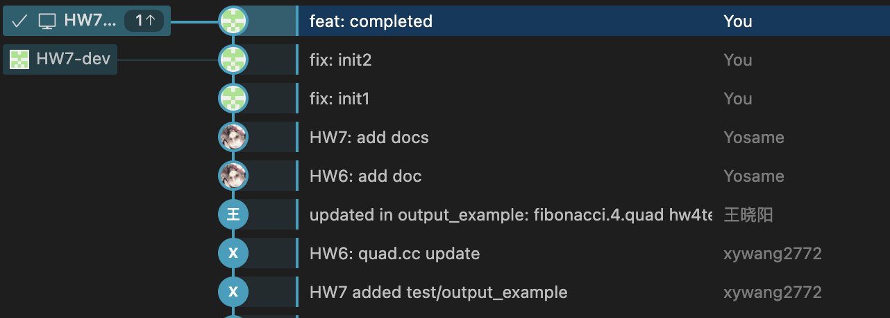
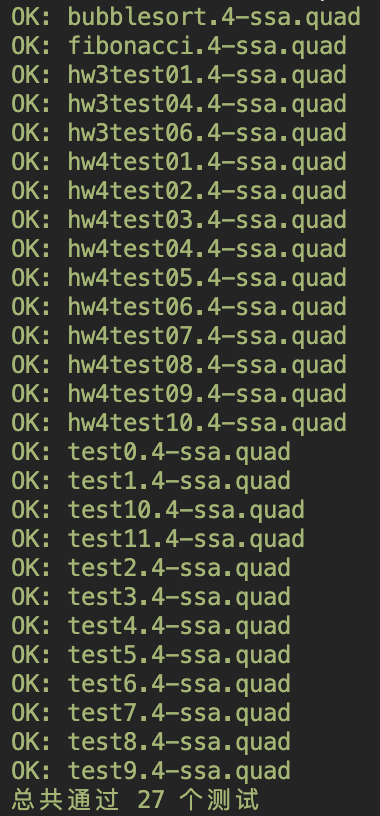

<h1>
  Compiler Lab Report:
  HW7
  </h1>

> **Name**: 韩周吾
>
> **ID**: 22307130440
>
> **Date**: 2025.05.08

---

#### 1. 删除不可达基本块 (`deleteUnreachableBlocks`)

这一步主要依赖于预先计算好的控制流信息。`deleteUnreachableBlocks` 函数直接调用 `domInfo->eliminateUnreachableBlocks()` 方法。`ControlFlowInfo` 类在计算过程中已经识别了从入口块不可达的基本块，此方法会负责将它们从函数的基本块列表中移除，从而简化后续的处理。

#### 2. 放置 Phi 函数 (`placePhi`)

`placePhi` 函数负责确定在哪些基本块的入口处需要插入 Phi 函数，以及为哪些变量插入。其实现流程如下：

1. **收集变量**: 首先，遍历函数的所有基本块 (`func->quadblocklist`) 和其中的四元式，通过检查四元式的 `def` 集合，收集函数中所有被定义的变量 (`set<Temp*> allVariables`)。
2. **确定定义块**: 对于 `allVariables` 中的每个变量，再次遍历基本块，找出定义该变量的基本块，并将这些块的标签编号存入 `set<int> definitionBlocks`。
3. **计算 Phi 放置块**: 这是核心部分，利用 Dominance Frontier (支配前沿) 的概念。Dominance Frontier 标识了控制流汇合点。如果在块 A 中定义了一个变量，并且某个块 B 位于 A 的 Dominance Frontier 中，那么在块 B 中就需要一个 Phi 函数来合并来自 A (以及可能其他支配 A 的前驱块) 的变量值。 代码中通过一个工作列表算法 (set<int> worklist) 实现这一计算：
   - 初始化 `worklist` 为 `definitionBlocks`。
   - 当 `worklist` 不为空时，取出一个块 `blockId`。
   - 遍历 `blockId` 的支配前沿 (`domInfo->dominanceFrontiers[blockId]`) 中的每一个块 `frontierBlock`。
   - 如果 `frontierBlock` 尚未被标记为需要放置 Phi 的块 (`phiBlocks.find(frontierBlock) == phiBlocks.end()`)，则将其加入 `phiBlocks`。
   - **重要**: 如果 `frontierBlock` 本身也是该变量的定义块 (`definitionBlocks.find(frontierBlock) != definitionBlocks.end()`)，则将其加入 `worklist`，以计算其 Dominance Frontier，这是为了处理嵌套结构（如循环）中 Phi 函数的放置。
4. **插入 Phi 函数**: 遍历最终计算出的 phiBlocks 集合。对于每个需要放置 Phi 的块 blockId
   - 获取对应的 `QuadBlock` 指针 (`domInfo->labelToBlock[blockId]`)。
   - 为该块的每个前驱基本块 (`domInfo->predecessors[blockId]`) 创建一个 Phi 函数的参数项 (`pair<Temp*, Label*>`)，参数的 `Temp*` 初始是原始变量，`Label*` 是前驱块的入口标签。这些参数收集在 `vector<pair<Temp*, Label*>>* phiArgs` 中。
   - 创建一个 `QuadPhi` 对象。注意，此时 Phi 的左侧目标变量和参数中的变量都是原始变量，它们将在 `renameVariables` 步骤中被替换为 SSA 版本。
   - 将新创建的 `QuadPhi` 四元式插入到基本块四元式列表 (`block->quadlist`) 的开始位置（通常在标签之后）。

#### 3. 重命名变量 (`renameVariables`)

`renameVariables` 函数执行核心的变量重命名操作，确保每个变量只被赋值一次。它采用了一种基于 Dominator Tree 的深度优先遍历方法，通过递归函数 `static void renameInBlock(...)` 来实现。

1. **收集类型信息**: 在重命名之前，`collectVariableTypeInfo` 函数遍历所有四元式，收集原始变量的类型信息 (`map<Temp*, Type>& tempTypes`)，这在创建新的 `TempExp` 时需要用到。
2. **递归遍历与状态管理**: `renameInBlock` 函数以基本块的标签编号 `blockNum` 作为参数，递归遍历 Dominator Tree (`domInfo->domTree`)。为了处理不同分支的变量版本，函数在进入一个块时会保存当前的变量版本映射状态 (`map<Temp*, Temp*> currentVersion`)，并在退出该块及其子树时恢复。`currentVersion` 映射原始变量到它在当前控制路径上的最新 SSA 版本。另一个映射 `map<Temp*, vector<Temp*>>& tempVersions` 记录了每个原始变量产生的所有 SSA 版本。
3. 处理基本块内的四元式: 在 renameInBlock 中，函数遍历当前块的四元式列表
   - **Phi 函数**: 对于 `QuadKind::PHI` 类型的四元式，调用 `processPhiFunction`。该函数会为 Phi 函数的左侧（目标变量 `phi->temp->temp`）创建一个新的 SSA 版本 (`createNewVersionOfTemp`)，并更新 `currentVersion` 和 `phi->def`。**注意**: 此时 Phi 参数中的变量 *不会* 被更新，它们代表了来自前驱块的传入值，需要在处理完前驱块后更新。
   - **其他四元式**: 对于其他类型的四元式，函数首先处理其使用（use）的变量。它遍历 `stmt->use` 集合，查找 `currentVersion` 中对应的最新 SSA 版本，并更新四元式中的 `QuadTerm`（通过 `updateQuadTermTemp` 函数）。例如，对于 `QuadMoveBinop`，它会更新 `moveBinop->left` 和 `moveBinop->right`。同时，为了与参考实现匹配，代码在更新 `use` 集合后进行了排序，甚至针对 `test0` 中的特定 CJUMP 进行了硬编码的参数交换。
   - 如果四元式有定义（如 `MOVE`, `LOAD`, `MOVE_BINOP` 等），它会为定义的目标变量 (`stmt->def` 中的变量，例如 `move->dst->temp`) 创建一个新的 SSA 版本 (`createNewVersionOfTemp`)，更新 `currentVersion`，并将新的 SSA 变量放入 `stmt->def` 集合。`createNewVersionOfTemp` 函数根据原始变量的编号和当前版本号生成新的 SSA 变量编号（例如 `origNum * 100 + version`），并记录在 `tempVersions` 中。
4. **更新后继块的 Phi 参数**: 在处理完当前基本块 *及其所有指令* 后，函数会遍历其所有后继基本块 (`domInfo->successors[blockNum]`)。对于每个后继块，它会查找其中的 Phi 函数。如果 Phi 函数的某个参数来自当前块（通过参数中的 `Label*` 与当前块的入口标签比较），则将该参数的 `Temp*` 更新为当前块中该原始变量的最新 SSA 版本（即在当前块处理结束时该变量在 `currentVersion` 中的值）。这是连接不同基本块中变量版本的关键步骤。
5. **递归处理子节点**: 遍历当前块在 Dominator Tree 中的所有子节点 (`domInfo->domTree[blockNum]`)，递归调用 `renameInBlock`。
6. **恢复状态**: 在所有子节点的递归调用完成后，恢复进入当前块时保存的 `currentVersion` 状态。
7. **重建 Phi use 集合**: 在所有块的重命名都完成后（即 `renameVariables` 函数的最后），再次遍历所有 Phi 函数。此时，它们的参数 (`phi->args`) 已经被更新为正确的 SSA 版本。代码会根据 `phi->args` 重新构建 `phi->use` 集合，确保 Phi 函数的 use 集合反映了其真正依赖的 SSA 变量版本。

#### 4. 清除无用 Phi 函数 (`cleanupUnusedPhi`)

`cleanupUnusedPhi` 函数负责识别并移除程序中计算结果未被任何后续指令使用的 Phi 函数。

1. **初始标记**: 首先，遍历所有非 Phi 四元式。如果一个变量 (`Temp*`) 在这些四元式的 `use` 集合中出现，说明这个变量是被实际使用的，将其添加到 `set<Temp*> usedTemps` 中。
2. **传播使用信息**: 进入一个循环 (`while (changed)`)，反复遍历所有基本块和四元式。如果遇到一个 Phi 函数，并且该 Phi 函数定义的结果变量 (`phi->temp->temp`) 已经被标记为 `usedTemps`，那么该 Phi 函数的输入变量（即 `phi->args` 中的变量）也应该被认为是“有用的”，因为它们的值流动到了一个被使用的变量。将 `phi->args` 中的变量添加到 `usedTemps` 中，如果 `usedTemps` 发生了变化，就设置 `changed = true`，继续下一轮循环，直到没有新的变量被标记为 used。
3. **移除无用 Phi**: 最后，再次遍历所有基本块中的四元式。如果一个四元式是 Phi 函数 (`QuadKind::PHI`)，并且其定义的结果变量 (`phi->temp->temp`) 不在最终的 `usedTemps` 集合中，则说明这个 Phi 函数的结果没有被任何地方使用，可以安全地删除它。代码使用 `block->quadlist->erase(it)` 来移除这些无用四元式。

---

## Graphs and Figures

