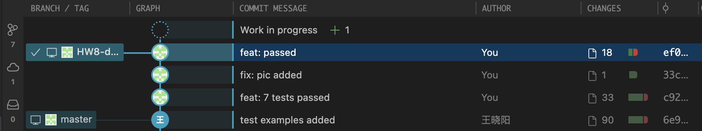
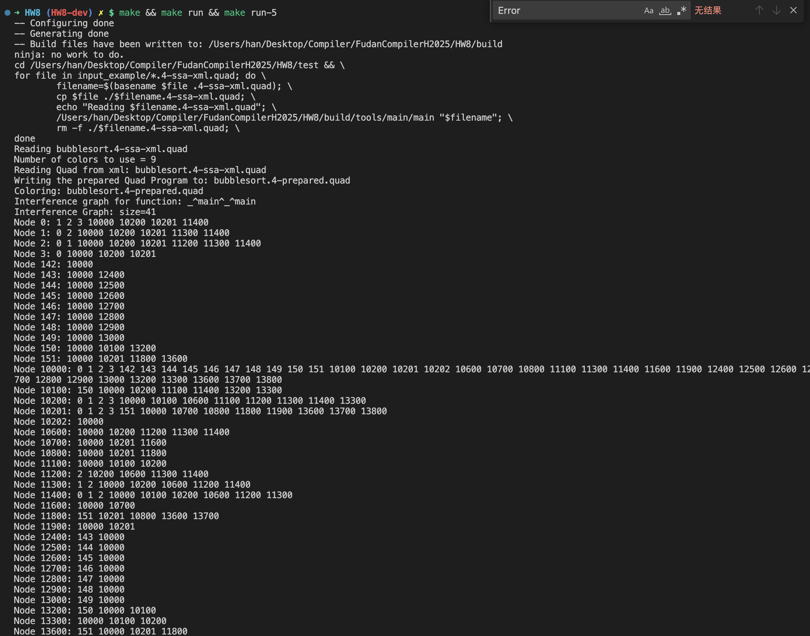

<div style="text-align: center"><h1>
  Compiler Lab Report:
  HW8
  </h1></div>


> **Name**: 韩周吾
>
> **ID**: 22307130440
>
> **Date**: 2025.05.21

---

## 一、设计逻辑

| 阶段     | 作用                               |
| -------- | ---------------------------------- |
| simplify | 删除度数 < k 的节点，压栈备选      |
| coalesce | 合并 move 指令相关节点，减少冗余   |
| freeze   | 冻结无法合并的 move 节点，便于简化 |
| spill    | 溢出度数太高的变量，将其分配到内存 |
| select   | 从栈中弹出并为节点分配实际颜色     |

------

## 二、详细实现分析

### 1. **Simplify 阶段：简化图结构**

#### 思路

删除当前图中所有非机器寄存器、且度数 < k 的节点。它们被认为在未来的 select 阶段**一定可以安全着色**，因此可先“压栈”暂存。

```cpp
for (auto &p : graph) {
    if (isMachineReg(node) || isMove(node)) continue;
    if (p.second.size() < k) {
        toSimplify.push_back(node);
    }
}
```

#### 效果

减少图中复杂度，使后续着色更容易，并为栈式回溯建立基础。

------

### 2. **Coalesce 阶段：合并 move 相关变量**

#### 思路

合并 `movePairs` 中的相关变量（如 `a = b`），如果合并后不会破坏着色性（即邻居度数仍可接受），就可以安全合并。

```cpp
bool isSafe = true;
for (int neighbor : allNeighbors) {
    if (graph[neighbor].size() >= k) {
        isSafe = false;
        break;
    }
}
```

合并操作包括：

- 修改邻接表，将 `removeNode` 的邻接边转移到 `keepNode`
- 更新 `coalescedMoves` 映射，记录合并来源
- 从 `movePairs` 中移除合并成功的项

#### 效果

减少不必要的 `move` 指令，提高生成代码效率。

------

### 3. **Freeze 阶段：冻结未能合并的 Move 节点**

#### 思路

冻结所有参与 move 但当前无法合并的、度数 < k 的节点，将它们视作普通节点用于 simplify。

```cpp
if (isMove(node) && it->second.size() < k) {
    freezeCandidates.push_back(node);
}
```

#### 效果

将瓶颈 move 节点“解冻”，使其参与简化，防止死锁或无法前进的状态。

------

### 4. **Spill 阶段：选择溢出节点**

#### 思路

若 simplify、coalesce、freeze 均无可操作节点，选择一个“最差”节点（度数最大）进行溢出处理。此为“软溢出”，真正溢出代码生成在 `select` 阶段后实现。

```cpp
if (degree > maxDegree) {
    maxDegree = degree;
    spillNode = node;
}
```

#### 效果

避免算法卡死在无简化、无可合并、无冻结的死局状态。

------

### 5. **Select 阶段：分配颜色**

#### 思路

从 `simplifiedNodes` 栈中弹出节点，为每个节点尝试分配不冲突的颜色（寄存器编号）。如果找不到合法颜色，则标记为 `spilled`。

同时对合并节点 `coalescedMoves` 分配与其主节点相同的颜色。

```cpp
for (int color = 0; color < k; color++) {
    if (usedColors.find(color) == usedColors.end()) {
        chosenColor = color;
        break;
    }
}
```

最后使用 `checkColoring()` 验证所有冲突节点着色是否合法。

#### 效果

实现最终着色方案，输出分配结果。


---

## Graphs and Figures




